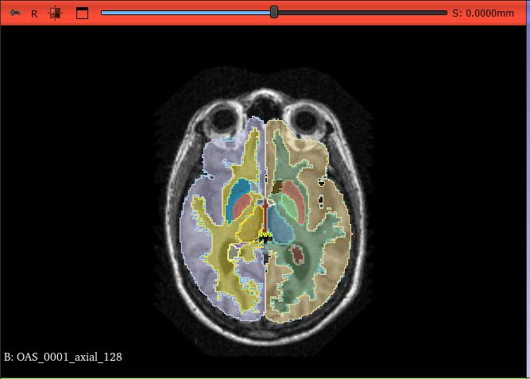
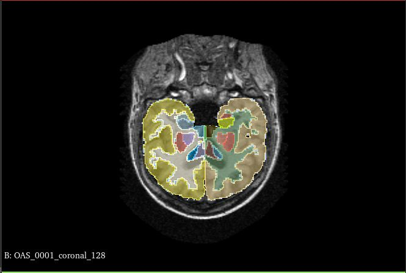
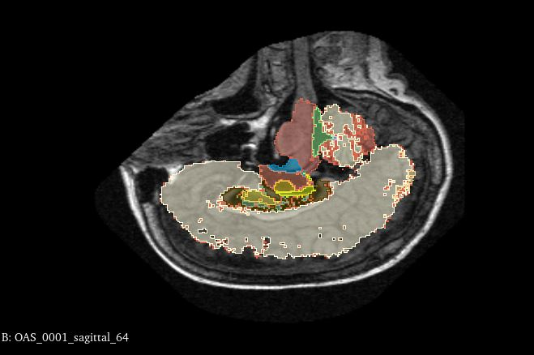

# Test de différentes méthodologies de création de coupe

Une des problématiques qui ont avons est de savoir si les coupes qui nous créons correspondent bien aux coupes axiales, coronales et sagittales. De plus, comment savoir si les segmentations seront adaptées aux coupes en niveau de gris sachant que nous les enregistrons pas ?

#### Problématique que nous avons rencontré:
Lors de la création des coupes, nous utilisions au départ la libraire SimpleITK. Nous appliquions la fonction `GetArrayFromImage` puis nous coupions le volume pour en extraire les informations avec `np.unique`. Or, lorsque nous avons voulu généraliser le procédé pour tous les volumes avec des images fixes qui n'étaient plus des IBSR, nous avions des problèmes de taille des volumes.

En effet, la fonction `GetArrayFromImage` ne semble pas conserver l'orientation des axes. Pour un IBSR recalé sur une image IXI en recalage inverse la taille du volume est (256, 256, 136) mais la taille du volume après passage dans `GetArrayFromImage` est (136, 256, 256). Cette inversion pourrait être la même à chaque fois mais pour la segmentation d'un IBSR qui est (256, 128, 256), le passage par cette fonction ne change rien et donne une taille de (256, 128, 256).
Lorsque nous avons essayé avec la librairie nibabel, les axes ne semblait plus inversés. La confusion sur le fonctionnement de ces différentes librairies a poussé à tester différentes méthodes de création de coupe.

Voici une présentation de plusieurs méthodologies de création de coupe que nous avons testé sur des volumes IXI recalé sur IXI.

## Librairie Nibabel

### Niveau de gris
 
Les coupes sont faites selon les mêmes procédés pour les images en niveau de gris et les segmentations pour obtenir les csv.

#### slice_NG.py
Prend un volume en niveau de gris en entrée et crée toutes les coupes avec la librairie nibabel. Ce code applique la fonction `fdata` de nibabel sur le volume avant de créer les coupes, puis reforme des images Nifti 2D avec `nib.Nifti1Image`

IXI_476_IXI_293_axial_64.nii.gz  
  

IXI_476_IXI_293_coronal_101.nii.gz  
  

IXI_476_IXI_293_sagittal_150.nii.gz
   

#### slice_NG_without_fdata.py
Prend un dossier en entrée contenant des volumes en niveau de gris, séléctionne un volume au hasard et extrait toutes les coupes. Ce code crée les images des coupes selon la fonction `slicer` de nibabel, et du coup n'a pas besoin de recréer une image nifti.

IXI_424_IXI_305_axial_80.nii.gz  
  

IXI_424_IXI_305_coronal_94.nii.gz  
  

IXI_424_IXI_305_sagittal_104.nii.gz  
  

### CSV

#### slice_csv.py
Prend un dossier en entrée contenant des volumes en niveau de gris et crée tous les csv regroupant toutes les informations dans les coupes de tous les volumes du dossier.
Ce code applique la fonction `fdata` de nibabel sur le volume segmenté de l'image fixe avant de créer les coupes, et extrait les informations avec `np.unique`

IXI_035_IXI_233.csv

coronal,90,"(256, 136)","(0.93751323, 0.937506, 1.2000031)","[(0, 26787), (2, 832), (3, 1916), (7, 28), (8, 1072), (41, 764), (42, 1909), (46, 58), (47, 1033), (73, 417)]"  
coronal,91,"(256, 136)","(0.93751323, 0.937506, 1.2000031)","[(0, 26648), (2, 813), (3, 1988), (7, 55), (8, 1073), (41, 792), (42, 1931), (46, 69), (47, 1043), (73, 404)]"

#### slice_csv_ fdata_after_slicer.py
Prend un dossier en entrée contenant des volumes en niveau de gris et crée tous les csv regroupant toutes les informations dans les coupes de tous les volumes du dossier.
Ce code applique la fonction `slicer` de nibabel sur le volume segmenté de l'image fixe, applique la fonction `fdata` sur ces coupes et extrait les informations avec `np.unique`

*met plus longtemps à s'éxecuter*  
IXI_035_IXI_233.csv

coronal,90,"(256, 1, 136)","(0.93751323, 0.937506, 1.2000031)","[(0, 26787), (2, 832), (3, 1916), (7, 28), (8, 1072), (41, 764), (42, 1909), (46, 58), (47, 1033), (73, 417)]"  
coronal,91,"(256, 1, 136)","(0.93751323, 0.937506, 1.2000031)","[(0, 26648), (2, 813), (3, 1988), (7, 55), (8, 1073), (41, 792), (42, 1931), (46, 69), (47, 1043), (73, 404)]"

#### Conclusion
Ce sont les même éléments mais comment savoir si c'est bien la coronal dans les deux cas sans regader le niveau de gris à chaque fois ?

## Librairie SimpleITK
### Niveau de gris
*choisi un fichier au hasard dans le dossier et exporte toutes les coupes de ce volume*

#### slice_NG_sitk.py
Prend un dossier en entrée contenant des volumes en niveau de gris, séléctionne un volume au hasard et extrait toutes les coupes. Ce code crée les coupes selon `image_slice = image[i, :, :]`

Apparition de cette erreur:  
WARNING: In /tmp/SimpleITK-build/ITK/Modules/IO/NIFTI/src/itkNiftiImageIO.cxx, line 2191
NiftiImageIO (0x55b245dbfc10): Non-orthogonal direction matrix coerced to orthogonal

IXI_476_IXI_293_axial_93.nii.gz  
  

IXI_476_IXI_293_coronal_103.nii.gz  
  

IXI_476_IXI_293_sagittal_103.nii.gz  
  

### CSV

#### slice_csv_sitk.py
Prend un dossier en entrée contenant des volumes en niveau de gris et créer tous les csv regroupant toutes les informations dans les coupes de tous les volumes du dossier.
Ce code crée les coupes selon `image_slice = image[i, :, :]` du volume segmenté de l'image fixe, applique la fonction `GetArrayFromImage` de SimpleITK sur ces coupes et extrait les informations avec `np.unique` 

IXI_035_IXI_233.csv

coronal,90,"(256, 136)","(0.9375132322311401, 0.9375060200691223, 1.2000031471252441)","[(0, 26787), (2, 832), (3, 1916), (7, 28), (8, 1072), (41, 764), (42, 1909), (46, 58), (47, 1033), (73, 417)]"  
coronal,91,"(256, 136)","(0.9375132322311401, 0.9375060200691223, 1.2000031471252441)","[(0, 26648), (2, 813), (3, 1988), (7, 55), (8, 1073), (41, 792), (42, 1931), (46, 69), (47, 1043), (73, 404)]"

### Conclusion
A première vue, les csv produit par nibabel et simpleITK semblent être identiques.

# Correlation entre coupe en niveu de gris et coupe de la segmentation

## slice_and_seg.py
Le code `slice_and_seg.py` crée un dossier slice pour une volume en niveau de gris mis en entrée. Il exporte une coupe au milieu de chaque axe et une coupe de la segmentation associée au même endroit.

OASIS_0001:

