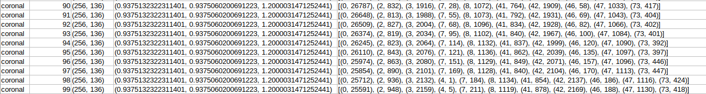

# Nibabel

## Niveau de gris
*choisis un fichier au hasard dans le dossier et exporte toutes les coupes de ce volume*
Les coupes sont faites celon les même procéder pour les image en niveau de gris et les segmentations pour obtenir les csv
### slice_NG.py

### slice_NG_without_fdata.py

### Conclusion

## CSV

### slice_csv.py
IXI_035_IXI_233.csv

coronal,90,"(256, 136)","(0.93751323, 0.937506, 1.2000031)","[(0, 26787), (2, 832), (3, 1916), (7, 28), (8, 1072), (41, 764), (42, 1909), (46, 58), (47, 1033), (73, 417)]"
coronal,91,"(256, 136)","(0.93751323, 0.937506, 1.2000031)","[(0, 26648), (2, 813), (3, 1988), (7, 55), (8, 1073), (41, 792), (42, 1931), (46, 69), (47, 1043), (73, 404)]"

### slice_csv_ fdata_after_slicer.py
*met plus longtemps à s'éxecuter*
IXI_035_IXI_233.csv

coronal,90,"(256, 1, 136)","(0.93751323, 0.937506, 1.2000031)","[(0, 26787), (2, 832), (3, 1916), (7, 28), (8, 1072), (41, 764), (42, 1909), (46, 58), (47, 1033), (73, 417)]"
coronal,91,"(256, 1, 136)","(0.93751323, 0.937506, 1.2000031)","[(0, 26648), (2, 813), (3, 1988), (7, 55), (8, 1073), (41, 792), (42, 1931), (46, 69), (47, 1043), (73, 404)]"

### Conclusion
Se sont les même éléments mais comment savoir si c'est bien la coronal dans les deux cas sans regader le niveau de gris à chaque fois ?

# SimpleITK
## Niveau de gris
*choisis un fichier au hasard dans le dossier et exporte toutes les coupes de ce volume*
### slice_sitk.py

Apparition de cette erreur:
WARNING: In /tmp/SimpleITK-build/ITK/Modules/IO/NIFTI/src/itkNiftiImageIO.cxx, line 2191
NiftiImageIO (0x55b245dbfc10): Non-orthogonal direction matrix coerced to orthogonal

## CSV

### slice_csv_sitk.py
Extraction des informations avec *GetArrayFromImage* après avoir fait la coupe.

IXI_035_IXI_233.csv

coronal,90,"(256, 136)","(0.9375132322311401, 0.9375060200691223, 1.2000031471252441)","[(0, 26787), (2, 832), (3, 1916), (7, 28), (8, 1072), (41, 764), (42, 1909), (46, 58), (47, 1033), (73, 417)]"
coronal,91,"(256, 136)","(0.9375132322311401, 0.9375060200691223, 1.2000031471252441)","[(0, 26648), (2, 813), (3, 1988), (7, 55), (8, 1073), (41, 792), (42, 1931), (46, 69), (47, 1043), (73, 404)]"

## Conclusion
A première vue, le csv semblent être la même chose.
